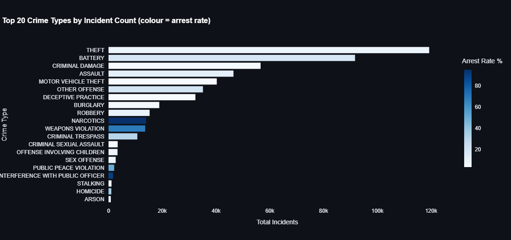
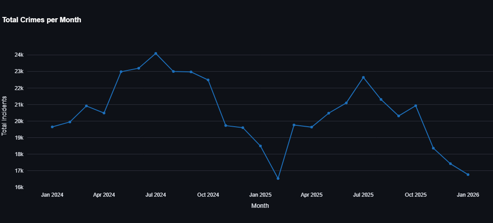

# 🔵 Chicago Crime Analytics Pipeline

[](https://github.com/DataTalksClub/data-engineering-zoomcamp)
[](https://www.python.org/downloads/)
[](https://www.getdbt.com/)
[](https://aws.amazon.com/s3/)
[](https://www.terraform.io/)
[](https://www.prefect.io/)
[](https://streamlit.io/)

An end-to-end data engineering project built as a capstone for the **Data Engineering Zoomcamp**. This pipeline automates the ingestion of Chicago's open crime data, processes it in a cloud-native environment, and surfaces analytical insights via an interactive dashboard.

---

## 📖 Problem Statement
The City of Chicago publishes every recorded crime incident since 2001 via its Open Data Portal. However, the sheer volume of data makes it difficult to derive quick insights without a structured data warehouse.

This project builds a fully automated batch pipeline to answer:
- **Which crime types are most prevalent?**
- **How has overall crime volume changed month-over-month?**
- **Which crime types have the highest and lowest arrest rates?**

---

## 🏗️ Architecture

The pipeline leverages a "Modern Data Stack" approach with a focus on efficiency and portability:

1.  **Ingestion:** Python & Prefect extract data from the **Socrata API** in Parquet format.
2.  **Data Lake:** Raw files are stored in **AWS S3**, partitioned by `year` and `month`.
3.  **Data Warehouse:** **DuckDB** acts as the analytical engine, providing high-speed processing on the local machine.
4.  **Transformation:** **dbt-duckdb** handles the T in ELT, creating a staging layer and high-performance analytical marts.
5.  **Visualization:** A **Streamlit** dashboard provides a real-time interface for data exploration.

---

## 🛠️ Technologies

| Layer | Tool |
| :--- | :--- |
| **Cloud Storage** | AWS S3 |
| **Infrastructure as Code** | Terraform |
| **Orchestration** | Prefect (local) |
| **Data Lake** | AWS S3 (Parquet, partitioned by year/month) |
| **Data Warehouse** | DuckDB |
| **Transformations** | dbt-duckdb |
| **Dashboard** | Streamlit + Plotly |
| **Language** | Python 3.10+ |

---
## 📦 Dataset

| Property | Detail |
|:---|:---|
| Source | [Chicago Data Portal](https://data.cityofchicago.org/Public-Safety/Crimes-2001-to-Present/ijzp-q8t2) |
| Coverage | 2001 – present (~8M records) |
| Format | Socrata API (CSV/JSON) |
| Key columns | `date`, `primary_type`, `arrest`, `district`, `community_area` |

---
## 📂 Project Structure

```bash
chicago-crime-pipeline/
├── assets/                     # Dashboard screenshots
├── dashboard/
│   └── app.py                  # Streamlit dashboard application
├── dbt_project/
│   └── chicago_crime/
│       ├── models/
│       │   ├── staging/        # stg_chicago_crime.sql (Cleaning/Casting)
│       │   ├── marts/          # Analytical models (Aggregations)
│       │   └── schema.yml      # dbt tests and documentation
├── pipeline/
│   ├── ingest.py               # Prefect ingestion flow (Raw -> S3)
│   └── warehouse.py            # DuckDB table initialization
│   └── run_pipeline.py         # Master orchestration flow (full run)
├── terraform/                  # S3 bucket provisioning
│   └── main.tf
├── .env.example                # Environment variable template
├── requirements.txt            # Project dependencies
└── README.md

```
---

## ▶️ How to Reproduce

### 1. Prerequisites
- Python 3.10+
- AWS CLI configured (`aws configure`)
- Terraform installed
- Git

### 2. Clone & install

```bash
git clone https://github.com/mekingz1/chicago-crime-pipeline.git
cd chicago-crime-pipeline
python -m venv venv
# Windows:
.\venv\Scripts\activate
# Mac/Linux:
source venv/bin/activate

pip install -r requirements.txt
```

### 3. Configure environment

Copy the example file and fill in your values:

```bash
# Mac/Linux:
cp .env.example .env
# Windows:
copy .env.example .env
```

Your `.env` should look like this:

```
AWS_ACCESS_KEY_ID=your_access_key_here
AWS_SECRET_ACCESS_KEY=your_secret_key_here
AWS_REGION=us-east-1
S3_BUCKET_NAME=your-bucket-name-here
SOCRATA_BASE_URL=https://data.cityofchicago.org/resource/ijzp-q8t2.csv
PAGE_SIZE=10000
```
### 3b. Configure dbt profile

dbt looks for its profile in `~/.dbt/profiles.yml` by default. Add the
following to that file (create it if it doesn't exist):

```yaml
chicago_crime:
  target: dev
  outputs:
    dev:
      type: duckdb
      path: "../../database/chicago_crime.duckdb"
      threads: 4
```

> The path is relative to `dbt_project/chicago_crime/` — where dbt runs from. Make sure you run dbt commands from that directory as shown in step 5.
---
### 4. Provision S3 bucket with Terraform

```bash
cd terraform
terraform init
terraform apply    # type 'yes' when prompted
cd ..
```

### 5. Run the full pipeline (recommended)
This single command runs ingestion → warehouse → dbt → dashboard in sequence:

```bash
python pipeline/run_pipeline.py --start 2022-01 --end 2024-12
```

Open `http://localhost:8501` when it completes.

### 5b. Run steps individually (optional)
If you prefer to run each step manually:

```bash
# Ingest only
python pipeline/ingest.py --start 2024-01 --end 2024-06

# Build warehouse
python pipeline/warehouse.py

# dbt transformations
cd dbt_project/chicago_crime
dbt run
dbt test
cd ../..

# Launch the Dashboard
streamlit run dashboard/app.py
```
---
## 📊 Dashboard




---


## 🗄️ Data Warehouse Design

**Partitioning strategy:**
The raw table is physically sorted by `year → month → primary_type`. This mimics
Hive-style partitioning within DuckDB — time-range queries scan only the relevant
row groups, and filtering by crime type within a month has high locality.

**Why this ordering?**
- Dashboard tile 2 (time series) queries by `year` and `month` → benefits from
  the first two sort keys
- Dashboard tile 1 (crime distribution) filters and groups by `primary_type` →
  benefits from the third sort key
- Both mart tables are materialised as `TABLE` (not `VIEW`) so the dashboard
  reads pre-aggregated results instantly with no re-computation at query time

---

## 🔄 Incremental Ingestion

The pipeline writes a `manifest.json` to S3 after each successful month.
On re-runs, completed months are skipped automatically. To backfill:

```bash
python pipeline/ingest.py --start 2020-01 --end 2023-12
```

---
## ⚠️ Known Issues

**403 Forbidden during ingestion**
The Chicago Data Portal may block requests from certain geographic regions
or IP addresses. If you encounter this error the pipeline will stop cleanly
and display instructions. Connect to a VPN (US-based server recommended)
and re-run — already-ingested months are skipped automatically so no
progress is lost.